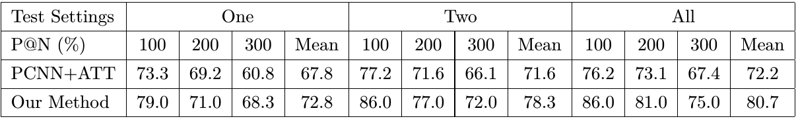
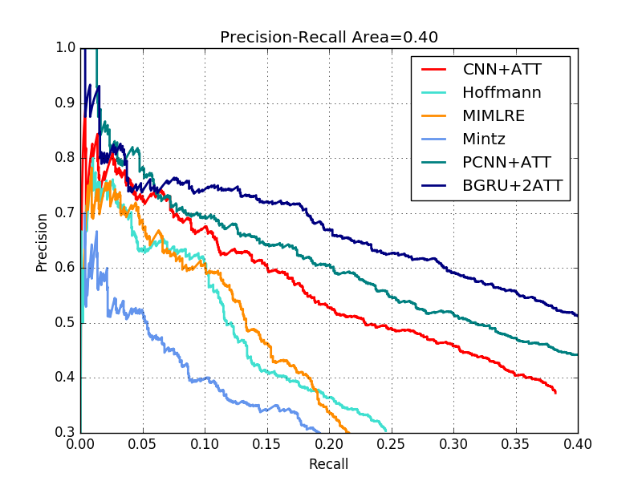

#Neural Relation Extraction(NRE)
Neural relation extraction aims to extract relations from plain text with neural models, which has been the state-of-the-art methods for relation extraction. In this project, we provide our implementations of a word-level and sentence-level combined Bidirectional GRU network.  

We come up with the idea from the paper "Attention-Based Bidirectional Long Short-Term Memory Networks for Relation Classification" [Zhou et al.,2016] and the paper "Neural Relation Extraction with Selective Attention over Instances" [Lin et al.,2016]. And we compare our results with PCNN+ATT [Lin et al.,2016] on the same dataset.
#Evaluation Results
P@N comparison between PCNN+ATT and our method

Precision/Recall curve of our method compared to others'

#Data
We use the same dataset(NYT10) as in [Lin et al.,2016]. And we provide it in origin_data/ directory. NYT10 is originally released by the paper "Sebastian Riedel, Limin Yao, and Andrew McCallum. Modeling relations and their mentions without labeled text."  

Pre-Trained Word Vectors are learned from New York Times Annotated Corpus (LDC Data LDC2008T19), which should be obtained from LDC (https://catalog.ldc.upenn.edu/LDC2008T19). And we provide it also in the origin_data/ directory.

To run our code, the dataset should be put in the folder origin_data/ using the following format, containing four files
- train.txt: training file, format (fb_mid_e1, fb_mid_e2, e1_name, e2_name, relation, sentence).
- test.txt: test file, same format as train.txt.
- relation2id.txt: all relations and corresponding ids, one per line.
- vec.txt: the pre-train word embedding file

Before you train your model, you need to type the following command:  
`python initial.py`  
to transform the original data into .npy files for the input of the network. The .npy files will be saved in data/ directory.

#Codes
The source codes are in the current main directory.

#Requirements
- Python (>=2.7)
- TensorFlow (>=r0.11)
- scikit-learn (>=0.18)
- Matplotlib (>=2.0.0)

#Train
For training, you need to type the following command:  
`python train_GRU.py`  
The training model file will be saved in folder model/
#Test
For testing, you need to run the test_GRU.py to get all results on test dataset. BUT before you run it, you should change the pathname and modeliters you want to perform testing on in the test_GRU.py. We have add 'ATTENTION' to the code in test_GRU.py where you have to change before you test your own models.  

As an example, we provide our best model with the prefix "sample" in the model/ directory. You just need to type the following command:  
`python test_GRU.py`  
The testing results will be printed(mainly the P@N results and the area of PR curve) and the all results on test dataset will be saved in out/ directory with the prefix "sample"  

To draw the PR curve for the sample model, you just need to type the following command:  
`python plot_pr.py`  
The PR curve will be saved as .png in current directory. If you want to plot the PR curve for your own model, you just need to change the modeliters in the plot_pr.py where we annotated 'ATTENTION'.

#Reference
[Zeng et al., 2014] Daojian Zeng, Kang Liu, Siwei Lai, Guangyou Zhou, and Jun Zhao. Relation classification via convolutional deep neural network. In Proceedings of COLING.  

[Zeng et al.,2015] Daojian Zeng,Kang Liu,Yubo Chen,and Jun Zhao. Distant supervision for relation extraction via piecewise convolutional neural networks. In Proceedings of EMNLP.  

[Zhou et al.,2016] Zhou P, Shi W, Tian J, et al. Attention-Based Bidirectional Long Short-Term Memory Networks for Relation Classification[C] Meeting of the Association for Computational Linguistics. 2016:207-212.  

[Lin et al., 2016] Yankai Lin, Shiqi Shen, Zhiyuan Liu, Huanbo Luan, and Maosong Sun. Neural Relation Extraction with Selective Attention over Instances. In Proceedings of ACL.
